[ES Español](README_es.md)

# Writeup: Caesar Cipher Decryption & Brute Force (Python)

> **Disclaimer:** All projects and writeups in this repository are conducted in controlled, isolated laboratory environments for educational purposes, defensive research, and incident response training. 

## MITRE ATT&CK Mapping
*   **Tactics:** Credential Access, Defense Evasion.
*   **Techniques:**
    *   [T1140] Deobfuscate/Decode Files or Information
    *   [T1110] Brute Force

---

## 1. Attack Fundamentals

For the Caesar cipher, which uses a substitution algorithm, the optimal attack technique is brute force[cite: 1]. This allows testing the entire space of possible keys[cite: 1]. The logic involves trying different substitution numbers until the correct key is found[cite: 1]. 

For the English alphabet, an attacker can try up to 26 different keys, where the key indicates the number of positions shifted[cite: 1]. 
Example for the ciphertext "KROD"[cite: 1]:
* clave 1 → JQNC[cite: 1]
* clave 2 → IPMB[cite: 1]
* clave 3 → HOLA (makes sense)[cite: 1]
* clave 4 → GNKZ[cite: 1]

---

## 2. Environment Setup

First, a text editor (Emacs) is installed on the attacking machine to write the script[cite: 1].

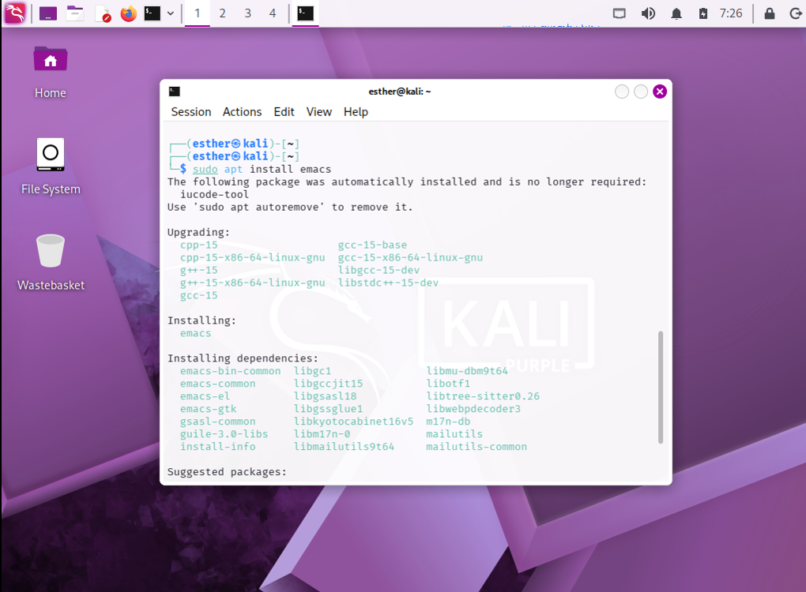

Next, the script named `cifrado_cesar_fb.py` is opened[cite: 1].

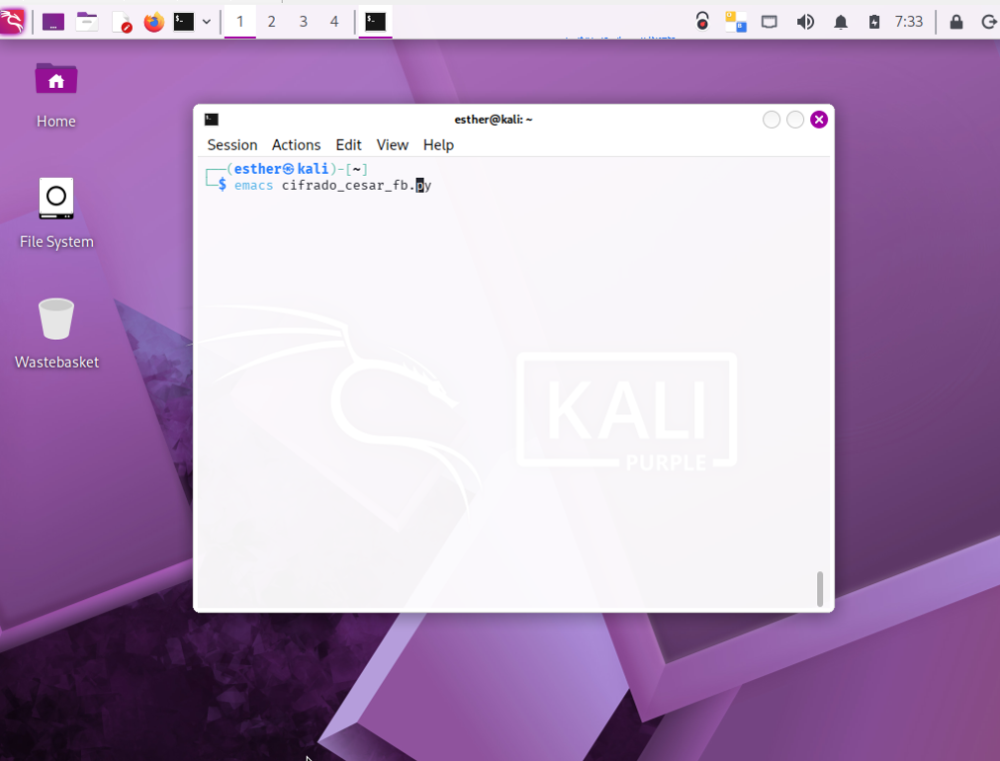

This is the file where the code will be written[cite: 1].

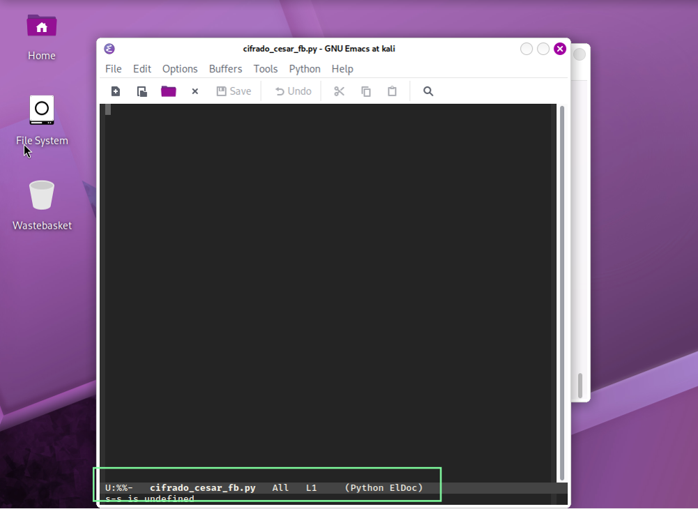

---

## 3. Manual Decryption Algorithm

First, the baseline function for decrypting the text is defined[cite: 1]. The `algoritmo_descifrado()` function takes a ciphertext and a key[cite: 1]. It initializes an empty string (`texto_plano`) and, using a `for` loop, iterates through each character to apply the reverse shift[cite: 1]. The `clave_descifrado` value determines the number of positions to step back[cite: 1].

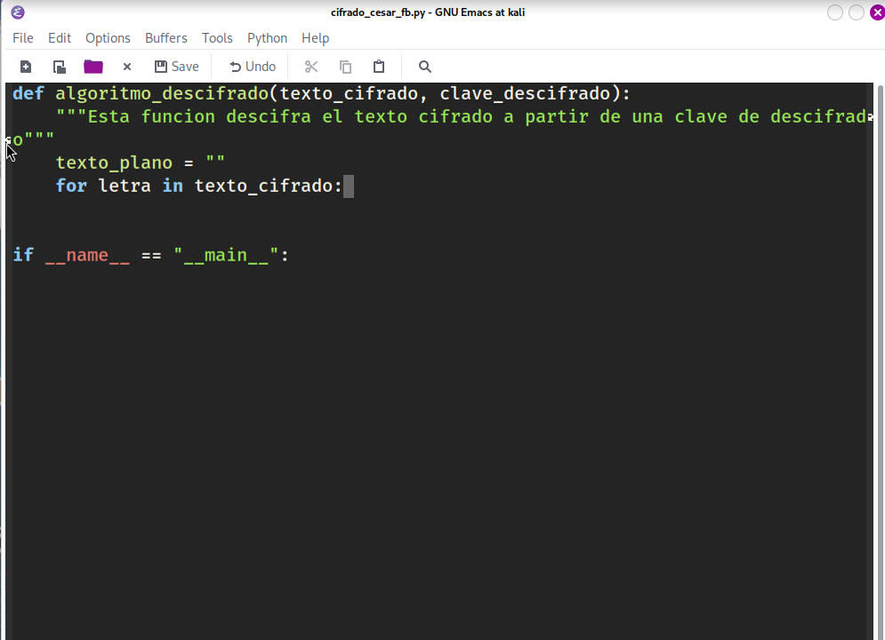

It is necessary to validate that each letter belongs to the English alphabet, which is imported from Python's `string` library[cite: 1].

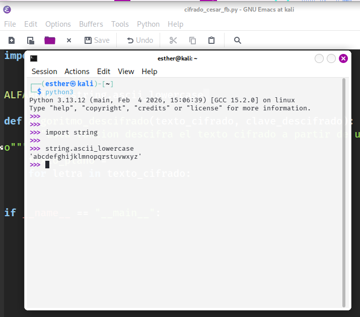

The script iterates through each character: if it does not belong to the alphabet, it is kept unchanged; if it is a letter, it retrieves its position, subtracts the key, and appends the resulting letter to `texto_plano`, returning the final message[cite: 1].

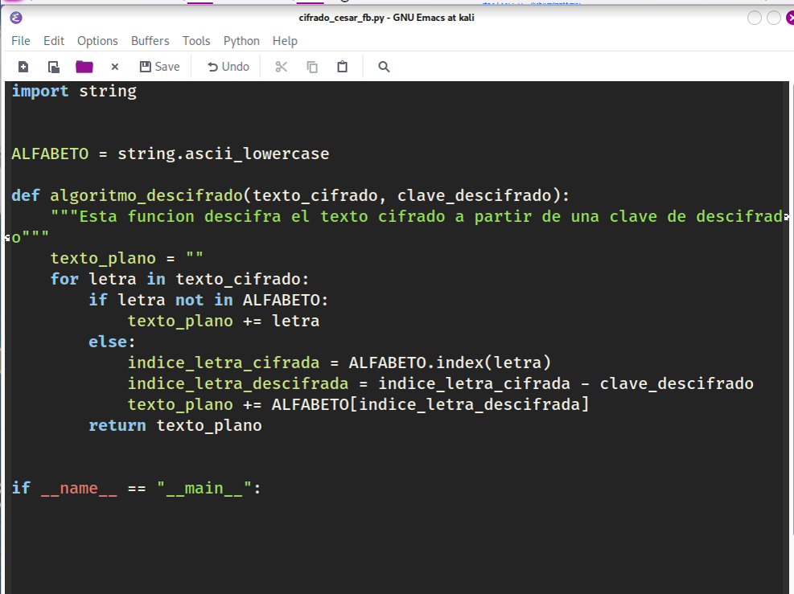

The program asks the user for the ciphertext and the key, converting the text to lowercase and the key to a numerical format[cite: 1].

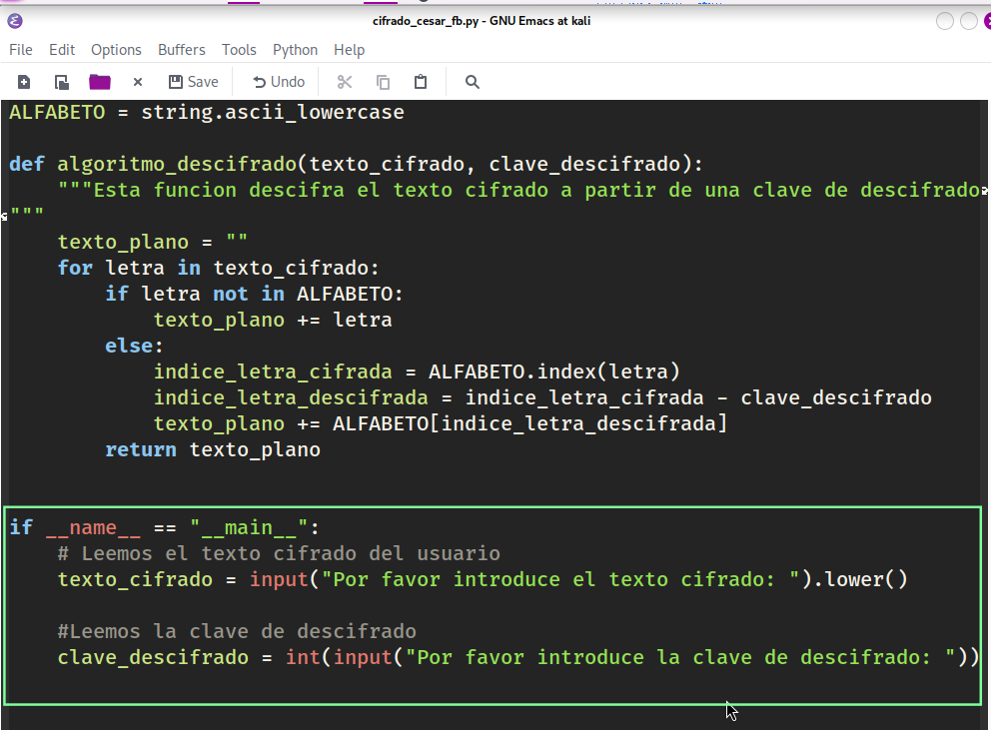

Finally, the `algoritmo_descifrado()` function is called, the result is stored in `texto_plano`, and it is displayed on the screen using `print()`[cite: 1].

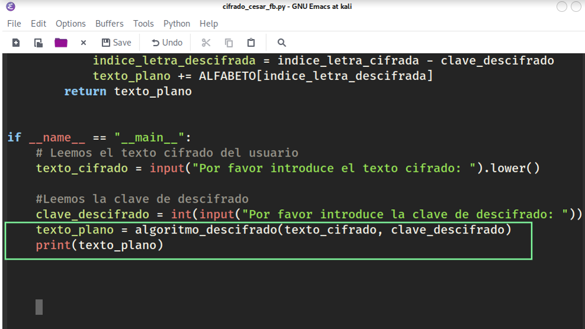

Executing `python3 cifrado_cesar_fb.py` with the text "krod" and key 3 returns the perfectly decrypted text: "hola"[cite: 1].

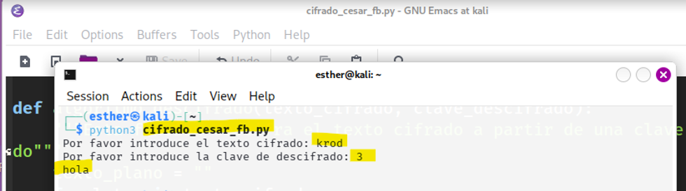

---

## 4. Automation and Brute Force (Part 2)

In this second phase, an additional function is programmed to automatically implement the brute force attack[cite: 1]. To find the key that returns a meaningful text, language detection is required using the `langdetect` library[cite: 1].

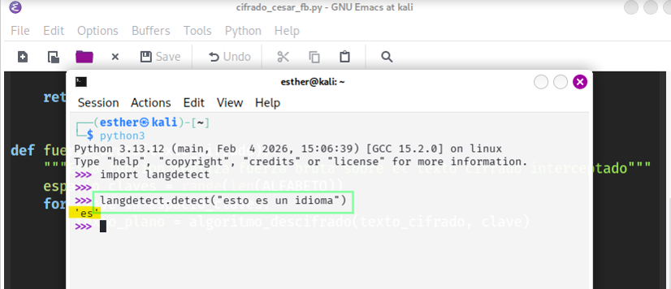

This library is imported into the script to use the `detect` function[cite: 1].

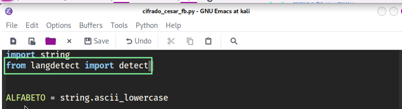

The brute force function is added, which tests all possible keys using `range(len(ALFABETO))`[cite: 1]. For each key, the text is decrypted, and `langdetect` checks if it is in Spanish ("es")[cite: 1]. Upon detection, it displays the message and the key used, terminating the search with `return`[cite: 1].

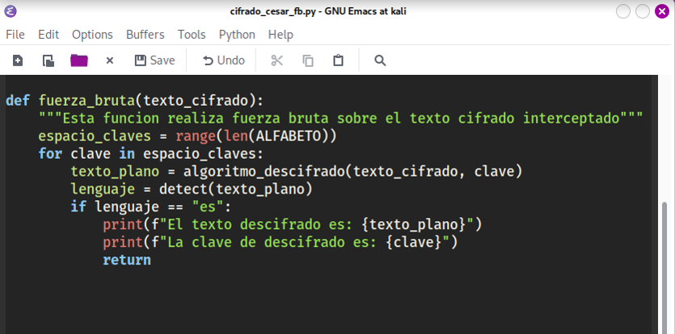

The code is updated to invoke this new `fuerza_bruta` function[cite: 1].

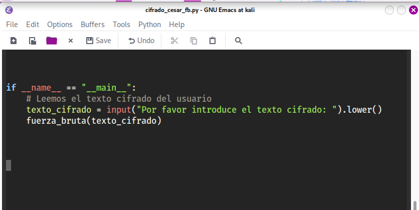

### 4.1. Final Validation

To validate the tool, a ciphertext is generated from `dcode.fr` using a key of 15[cite: 1]. The resulting ciphertext is "thid th jc itmid epgp sthrxugpg"[cite: 1].

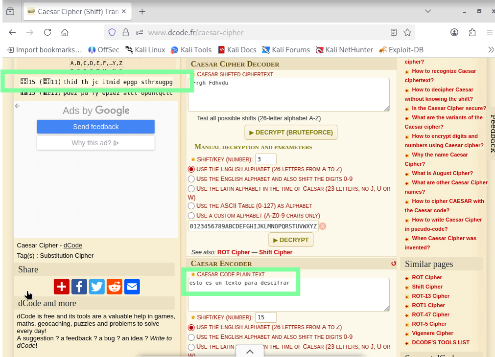

When executing the script against this text, the brute force attack works perfectly[cite: 1].

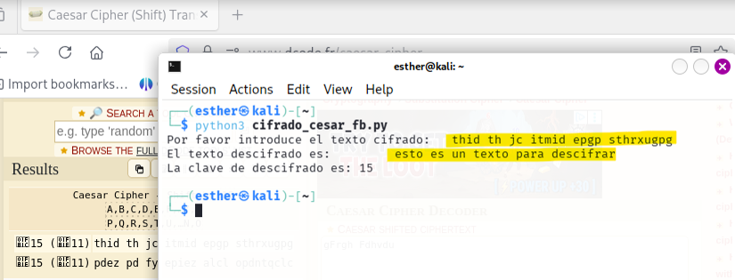