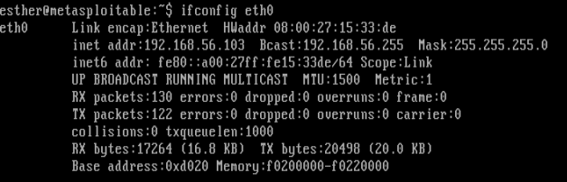
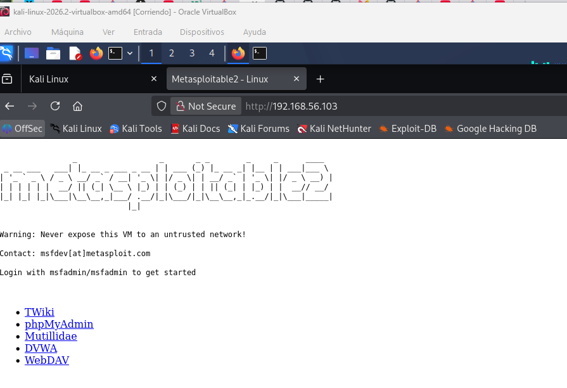
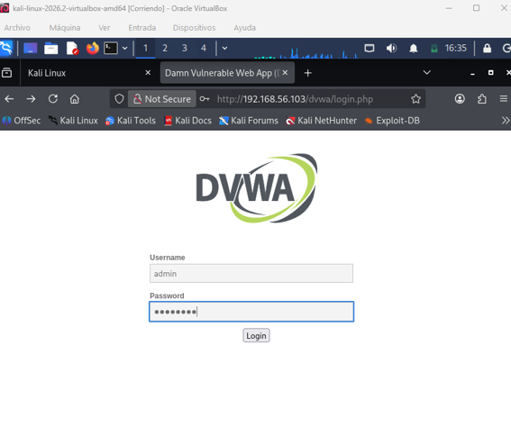
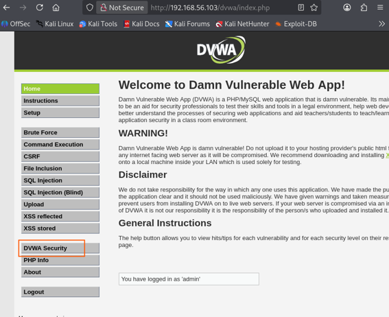
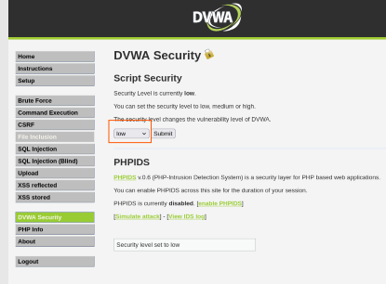
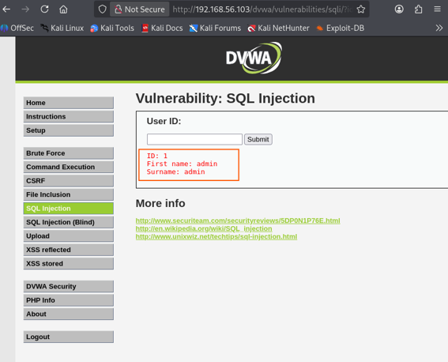
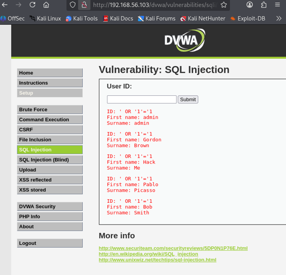
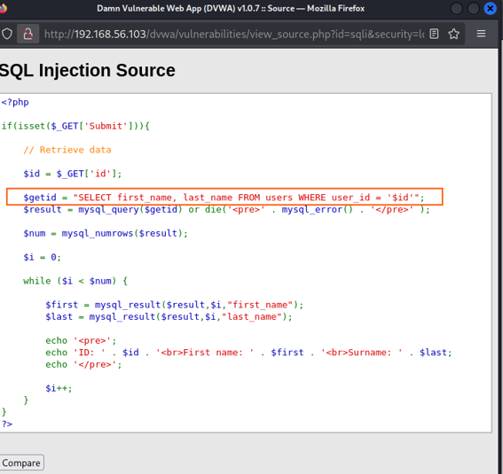
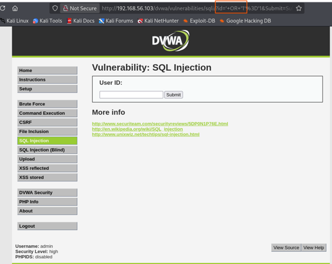

# 💉 Writeup: SQL Injection & Source Code Analysis (DVWA)

> **Disclaimer:** All projects and writeups in this repository are conducted in controlled, isolated laboratory environments for educational purposes, defensive research, and incident response training. 

## 🎯 MITRE ATT&CK Mapping
*   **Tactics:** Initial Access, Credential Access, Defense Evasion.
*   **Techniques:**
    *   [T1190] Exploit Public-Facing Application
    *   [T1212] Exploitation for Credential Access
    *   [T1027] Obfuscated Files or Information (Indicator removal via URL Encoding)

---

## 1. Entorno y Preparación (Environment Setup)

El ejercicio comienza comprobando la configuración de red de la máquina víctima (Metasploitable) para obtener su dirección IP[cite: 2].

Una vez confirmada la IP (`192.168.56.103`), se verifica el acceso al servidor web desde el navegador de la máquina atacante (Kali Linux)[cite: 2].

Se accede al portal de Damn Vulnerable Web App (DVWA) introduciendo las credenciales por defecto: `admin` y `password`[cite: 2].

---

## 2. Enumeración y Explotación (Low Security)

Para analizar la vulnerabilidad en su estado más crítico, se navega al menú "DVWA Security" y se configura el nivel de seguridad al nivel más bajo posible ("Low")[cite: 2].

### 2.1. Comportamiento Base
El primer paso de la enumeración consiste en comprobar cómo se comporta el aplicativo al introducir IDs de usuarios válidos (como 1, 2, 3...)[cite: 2]. La aplicación web devuelve un mensaje de error o la información del usuario esperado[cite: 2].

### 2.2. Inyección SQL (Boolean-Based)
A continuación, se prueba a inyectar una sentencia booleana clásica: `' OR '1'='1`[cite: 2]. 
Como resultado, se obtiene un error favorable para el atacante porque la aplicación concatena todos los fallos sin sanitizar la entrada previamente, volcando la información de todos los usuarios de la base de datos[cite: 2].

---

## 3. Análisis de Código (White-box Analysis)

Para entender exactamente qué ha sucedido en el backend, se revisa el código fuente PHP del aplicativo web[cite: 2].

La vulnerabilidad se resume en la interacción de tres elementos inyectados por el atacante[cite: 2]:
1.  **La comilla (`'`):** Engaña al sistema cerrando prematuramente el campo de texto, permitiendo que todo lo que se escriba después sea interpretado como comandos SQL ejecutables y no como simples palabras[cite: 2].
2.  **La inyección (`UNION SELECT`):** Altera la consulta original obligando a la base de datos a fusionar el resultado esperado con información confidencial extraída de otras tablas (como usuarios y contraseñas)[cite: 2].
3.  **El parche (`#`):** Convierte el resto del código original del desarrollador en un comentario ignorado, evitando así que queden restos de código suelto que rompan la sintaxis y hagan fallar el ataque[cite: 2].

---

## 4. Mitigación y Detección (High Security)

Finalmente, se procede a probar los mecanismos de defensa cambiando el modo de seguridad a "High" y volviendo a lanzar los pasos anteriores[cite: 2].

Con la consulta de las tres comillas o `' OR '1'='1`, la aplicación no arroja nada[cite: 2]. Al cambiar el nivel de seguridad a High e intentar una inyección booleana tradicional por GET, la aplicación mitiga el ataque de forma silenciosa, no devolviendo datos ni revelando la estructura de la base de datos mediante errores[cite: 2].

### 4.1. Perspectiva SOC (Detección de artefactos)
Aunque, según se observa en la barra de direcciones, sí se ha intentado la consulta[cite: 2]. La URL cambia por culpa del navegador web, no porque el servidor haya aceptado el ataque[cite: 2]. Esto significa que aunque el servidor haya bloqueado el ataque y la página no muestre ningún error, esta petición sí deja un rastro[cite: 2]. Este rastro en la URL (`%27`, `%3D`) es un artefacto crítico que un analista SOC puede monitorizar en los registros del servidor web (Access Logs) para detectar intentos activos de explotación en la red.
